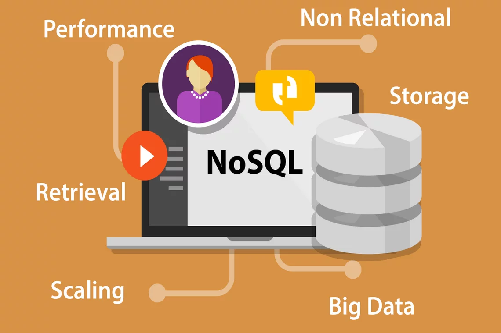

# Mongo DB
<br>
<div style="width:300px; height:200px"> 


</div>

<div style="font-size:25px; text-align:justify;"> 

1. [Nosql](#Introduction-to-Nosql)

2. [Json](#Json)

3. [MongoDB](#MongoDB)

4. [Working on MongoDB](#Working-on-MongoDB)

</div>

### Introduction to Nosql

<br>

<div style="font-size:20px; text-align:justify;"> 


{{1}} [What is NoSQL](#what-is-NoSQL)

{{2}} [Types of NoSql](#Types-of-NoSql)

{{3}} [Types of NoSql Examples](#Types-of-NoSql-Examples)

{{4}} [Features of NoSql](Features-of-nosql)

{{5}} [Difference between SQl and Nosql](Difference-between-SQl-and-Nosql)

</div>

#### What is NoSQL
<br>

<div style="font-size:20px; text-align:justify;"> 

* NoSQL (which stands for "not only SQL") is a type of database management system that is designed to handle large and diverse data sets. 

* NoSQL databases are often used for big data applications, such as social media analytics, real-time data processing, and internet of things (IoT) applications.

* They are well-suited for applications that require high availability and scalability, since they can be distributed across multiple servers and can easily scale horizontally by adding more nodes to the cluster.

* There are several types of NoSQL databases, including document databases (which store data in JSON or BSON documents), key-value stores (which store data as key-value pairs), column-family stores (which store data in columns rather than rows), and graph databases (which store data in nodes and edges).

* Some popular NoSQL databases include MongoDB, Cassandra, Couchbase, Redis, and Neo4j. 

</div>

#### Types of NoSql


#### Types of NoSql Examples

<div style="font-size:15px; text-align:justify;">   

* Document databases

```
{
"City" : "Bangalore",
"Address" : "MG Road",
"Email" : "abc@xyc.com",
"Contact" : "1234567890"
}

```
* Key-value stores


* Column-oriented databases


* Graph databases


</div>

#### Features of NoSql
<div style="font-size:20px; text-align:justify;"> 

*   Dynamic schema: NoSQL databases do not have a fixed schema and can accommodate changing data structures without the need for migrations or schema alterations.
*   Horizontal scalability: NoSQL databases are designed to scale out by adding more nodes to a database cluster, making them well-suited for handling large amounts of data and high levels of traffic.
*    Document-based: Some NoSQL databases, such as MongoDB, use a document-based data model, where data is stored in semi-structured format, such as JSON or BSON.
*   Key-value-based: Other NoSQL databases, such as Redis, use a key-value data model, where data is stored as a collection of key-value pairs.
*   Column-based: Some NoSQL databases, such as Cassandra, use a column-based data model, where data is organized into columns instead of rows.
*   Distributed and high availability: NoSQL databases are often designed to be highly available and to automatically handle node failures and data replication across multiple nodes in a database cluster.
*   Flexibility: NoSQL databases allow developers to store and retrieve data in a flexible and dynamic manner, with support for multiple data types and changing data structures.
*   Performance: NoSQL databases are optimized for high performance and can handle a high volume of reads and writes, making them suitable for big data and real-time applications.
</div>

#### Difference between sql and nosql

<div style="font-size:20px; text-align:justify;"> 

|                              SQL                              |                              NoSQL                             |
|:-------------------------------------------------------------:|:--------------------------------------------------------------:|
| RELATIONAL DATABASE MANAGEMENT SYSTEM (RDBMS)                 | Non-relational or distributed database system.                 |
| These databases have fixed or static or predefined schema     | They have dynamic schema                                       |
| These databases are not suited for hierarchical data storage. | These databases are best suited for hierarchical data storage. |
| These databases are best suited for complex queries           | These databases are not so good for complex queries            |
| Vertically Scalable                                           | Horizontally scalable                                          |
| Follows ACID property                                         | Follows CAP(consistency, availability, partition tolerance)    |
| Examples: MySQL, PostgreSQL, Oracle, MS-SQL Server, etc       | Examples: MongoDB, GraphQL, HBase, Neo4j, Cassandra, etc       |

</div>

### Json

<div style="font-size:20px; text-align:justify;"> 

* JSON stands for JavaScript Object Notation. A lightweight data-interchange format.

* It is a text format for storing and transporting data

* JSON is "self-describing" and easy to understand


<hr>

<br>

* Example:

```
 {
 "Name": "",
 "category": “Bytes",
 "clusterName": "1",
 "bytes": [“Abstraction”, “Inheritance”, “Encapsulation”, “Polymorphism”]
 }
```
<hr>
<br>
* A JSON object contains zero, one, or more key-value pairs, also called properties. The object is surrounded by curly braces { }. Every key-value pair is separated by a comma. The order of the key-value pair is irrelevant.

* A key-value pair consists of a key and a value, separated by a colon ( : ). The key is a string, which identifies the key-value pair. The value can be any of the following data types:

</div>


### MongoDB

<div style="width:300px; height:200px"> 

</div>

<div style="font-size:20px; text-align:justify;"> 

{{1}} [What is MongoDB](#What-is-Mongodb)

{{2}} [History of Mongodb](#History-of-Mongodb)

{{3}} [MongoDB Installation](MongoDB-Installation)

</div>


#### What is MongoDB 
<div style="font-size:20px; text-align:justify;"> 

* MongoDB is a popular document-oriented NoSQL database that uses a flexible JSON-like data model that allows for fast and easy querying of large amounts of data. 

* MongoDB stores data in collections of documents, rather than tables of rows, as in traditional relational databases. Each document can have a different structure, allowing for more flexible and dynamic data storage. 

* MongoDB supports complex queries, indexing, and aggregation, making it easy to manipulate and analyze large data sets.

* MongoDB is its ability to scale horizontally, meaning it can handle large amounts of data by distributing it across multiple servers.

* MongoDB also supports sharding, which allows for even more efficient distribution of data across a cluster of servers.

* MongoDB is an open-source project, and there are many third-party tools and libraries available for working with MongoDB data. 

</div>

<br>

<div style="font-size:20px; text-align:justify;"> 


</div>

#### History of Mongodb

<div style="font-size:20px; text-align:justify;"> 

* The development of MongoDB was started in early 2007 when the company was developing a Microsoft Azure-like platform as a service. 

* This was a New York based company name 10gen which is now changed its name to MongoDB Inc.

* The initial development was focused on building a PaaS (Platform as a Service), but later in 2009, MongoDB came to the market as an open-source database server and was maintained by this organization itself.

* In the year March 2010, it launched its first ready product which was version 1.4. The latest, as well as the stable version of MongoDB, is version 2.4.9 that was released on Jan 10, 2014.

</div> 

#### MongoDB Installation

<div style="font-size:20px; text-align:justify;"> 

<hr>
<br>

{{1}} [Windows](#Windows)
<br>


{{2}} [LinuxOS](#linux)
<br>


</div>


##### Windows 

<div style="font-size:20px; text-align:justify;"> 

* Step 1: Go to MongoDB Download Center to download MongoDB Community Server.


* Step 2: When the download is complete open the msi file and click the next button in the startup screen: 


* Step 3: Now accept the End-User License Agreement and click the next button:


* Step 4: Now select the complete option to install all the program features. Here, if you can want to install only selected program features and want to select the location of the installation, then use the Custom option:


* Step 5: Select “Run service as Network Service user” and copy the path of the data directory. Click Next:


* Step 6: Click the Install button to start the installation process:


* Step 7: After clicking on the install button installation of MongoDB begins:


* Step 8: Now click the Finish button to complete the installation process:


* Step 9: Now we go to the location where MongoDB installed in step 5 in your system and copy the bin path:


* Step 10: Now, to create an environment variable open system properties << Environment Variable << System variable << path <<div Edit Environment variable and paste the copied link to your environment system and click Ok:


* References 

[How to Install MongoDB on Windows](https://www.geeksforgeeks.org/how-to-install-mongodb-on-windows/)

</div>


##### Linux

<div style="font-size:20px; text-align:justify;"> 

* Step 1: Import the public key used by the package management system.The first step is to import the MongoDB public GPG Key from mongoDB.  

On a terminal, issue the following command for the same: 

```
> wget -qO - https://www.mongodb.org/static/pgp/server-6.0.asc | sudo apt-key add 

```

* Step 2: Create a list file for MongoDB
Step two is to create the list file /etc/apt/sources.list.d/mongodb-org-6.0.list for your version of Ubuntu. 

```
> lsb_release -dc. 
```

Create the /etc/apt/sources.list.d/mongodb-org-6.0.list file for Ubuntu 20.04 (Focal): 

```
> echo "deb [ arch=amd64,arm64 ] https://repo.mongodb.org/apt/ubuntu focal/mongodb-org/6.0 multiverse" | sudo tee /etc/apt/sources.list.d/mongodb-org-6.0.list 

```

* Step 3: Reload the local package database

```
> sudo apt-get update 
```

* Step 4: Install the MongoDB packages

```
> sudo apt-get install -y mongodb-org 
```

check the service's status by using the below command 

```
> sudo systemctl status mongodb 
```


[How to Install MongoDB on ubuntu](https://www.mongodb.com/docs/manual/tutorial/install-mongodb-on-ubuntu/)

</div>


#### Connecting to MongoDB


<div style="font-size:20px; text-align:justify;"> 


# There are different ways to connect to MongoDB, including:


* MongoDB Shell: MongoDB provides a shell that you can use to interact with the database directly from the command line. To connect to MongoDB using the shell, you can use the mongo command followed by the connection string.

* MongoDB Compass: MongoDB Compass is a GUI tool that allows you to connect to MongoDB databases and visualize your data. To connect to a MongoDB database using Compass, you can simply open the application, click on "New Connection", and enter the connection details.


* MongoDB Atlas: MongoDB Atlas is a fully managed cloud database service that allows you to easily deploy, manage, and scale your MongoDB database. To connect to a MongoDB database using Atlas, you can create a new Atlas cluster, add a database user, and then connect to the cluster using the connection string provided by Atlas.


* All three methods provide different ways to connect to MongoDB, depending on your preferences and requirements. The MongoDB Shell provides a powerful command line interface, while MongoDB Compass and Atlas provide a more user-friendly GUI interface for managing your databases.

</div>


## Working on mongodb

<div style="font-size:20px; text-align:justify;"> 

1. [Data types in MongoDB](#Data-types-in-MongoDB)

2. [MongoDB data Modeling ](#MongoDB-data-Modeling)

3. [Operations on Database ](#Operations-on-Database)

4. [Listing the Databases](#Listing-the-Databases)

5. [Dropping the databases](#Dropping-the-databases)

6. [Collections](#Collections)

7. [Documents](#Documents)

</div>

### Data types in MongoDB


<div style="font-size:20px; text-align:justify;"> 

* String − This is the most commonly used datatype to store the data. String in MongoDB must be UTF-8 valid.

* Integer − This type is used to store a numerical value. Integer can be 32 bit or 64 bit depending upon your server.

* Boolean − This type is used to store a boolean (true/ false) value.

* Double − This type is used to store floating point values.

* Min/ Max keys − This type is used to compare a value against the lowest and highest BSON elements.

* Arrays − This type is used to store arrays or list or multiple values into one key.

* Timestamp − ctimestamp. This can be handy for recording when a document has been modified or added.

* Object − This datatype is used for embedded documents.

* Null − This type is used to store a Null value.

* Symbol − This datatype is used identically to a string; however, it's generally reserved for languages that use a specific symbol type.

* Date − This datatype is used to store the current date or time in UNIX time format. You can specify your own date time by creating object of Date and passing day, month, year into it.

* Object ID − This datatype is used to store the document’s ID.

* Binary data − This datatype is used to store binary data.

* Code − This datatype is used to store JavaScript code into the document.

* Regular expression − This datatype is used to store regular expression.

</div>


### MongoDB data Modeling 

<div style="font-size:20px; text-align:justify;"> 

* Always design schema according to user requirements.
* Do join on write operations not on read operations.
* Objects which you want to use together, should be combined into one document. Otherwise they should  be separated (make sure that there should not be need of joins).
* Optimize your schema for more frequent use cases.
* Do complex aggregation in the schema.
* You should duplicate the data but in a limit, because disc space is cheaper than compute time.

For example:

* let us take an example of a client who needs a database design for his website. His website has the following requirements:

* Every post is distinct (contains unique title, description and url).

* Every post can have one or more tags.

* Every post has the name of its publisher and total number of likes.

* Each post can have zero or more comments and the comments must contain user name, message, data-time and likes.

* For the above requirement, a minimum of three tables are required in RDBMS.


</div>

### Operations on Database

<div style="font-size:20px; text-align:justify;"> 

1. [Creating Database](#Creating-database)

2. [Listing the Databases ](Listing-the-Databases)

3. [Dropping the databases](Dropping-the-databases)

</div>


#### Creating database
<div style="font-size:20px; text-align:justify;"> 

* Note all the demontration are done using shell 

* You can use MongoDB Shell or MongoDB Compass to create a new database

1. [Shell](#shell)
2. [Compass](#compass)

</div>

###### Shell:

<div style="font-size:20px; text-align:justify;"> 

```
 use <database-name>

```
* example: <br> 

* MongoDB will automatically switch to the newly created database. Notice that it promts to <br> <br> ``` humanResourceDB>    ``` 

</div>

###### Compass:


<div style="font-size:20px; text-align:justify;"> 

* You can create a new database using MongoDB Compass. For that, open Compass and connect with your local or remote database. Once it connects with the MongoDB server, click on the top "CREATE DATABASE" button which will open the popup window, as shown below.

 

</div>

#### Listing the Databases 

<div style="font-size:20px; text-align:justify;"> 

To List all the databases, use the "show dbs" command, as shown below.

``` 
show dbs

```
* "admin", "config", and "local" are default databases.

* example:


</div>

#### Dropping the databases

<div style="font-size:20px; text-align:justify;"> 

To delete a database, use the 

```
 db.dropDatabase() 
```

method which deletes a current database.

* Example:


* Note: Method names are case sensitive.
</div>

### Collections

<div style="font-size:20px; text-align:justify;"> 

* A collection is a grouping of MongoDB documents. Documents within a collection can have different fields. A collection is the equivalent of a table in a relational database system. A collection exists within a single database.

* Example: 


</div>

#### Creating collections


<div style="font-size:20px; text-align:justify;"> 

* A collection in MongoDB is similar to a table in RDBMS. MongoDB collections do not enforce schemas. Each MongoDB collection can have multiple documents. A document is equilant to row in a table in RDBMS.

* To create a collection, use the

```
db.createCollection(<collection name>)
``` 

command. The following creates a new employees collection in the current database.

* Example:


</div>

#### Show collections

<div style="font-size:20px; text-align:justify;"> 

 Use the

```
show collections 
```

commands to list all the collections in a database.
<br>
<hr>
<br>
 Example:

 


</div>

#### Drop Collections


<div style="font-size:20px; text-align:justify;"> 

* In MongoDB, db.collection.drop() method is used to drop a collection from a database. It completely removes a collection from the database and does not leave any indexes associated with the dropped collections.

```
db.COLLECTION_NAME.drop()  
```


commands to delete the collections.
<br>
<hr>
<br>
 Example:

 

</div>

#### Inserting collections


<div style="font-size:20px; text-align:justify;"> 

* MongoDB provides the following methods to insert documents into a collection:

```
insertOne() - Inserts a single document into a collection.
insert() - Inserts one or more documents into a collection.
insertMany() - Insert multiple documents into a collection.
```

</div>


###### InsertOne() 


<div style="font-size:20px; text-align:justify;"> 

* This method to insert a single document in a collection.

* Syntax:

```
db.collection.insertOne(document, [writeConcern])
```

* Example 

```

Input : 

db.employees.insertOne({ 
    firstName: "John",
    lastName: "King",
    email: "john.king@abc.com"
})

Output :

{
  acknowledged: true,
  insertedId: ObjectId("616d44bea861820797edd9b0")
}

```


</div>


###### Insert()

<div style="font-size:20px; text-align:justify;"> 

* The db.<collection>.insert() method inserts one document or an array of documents into a collection.

* Note : Using Insert() one or multiple collections can be intserted at a time. 

```
Syntax:
db.collection.insert(
        document or array of documents, 
)
```


</div>

###### InsertMany()


<div style="font-size:20px; text-align:justify;"> 

* Using InsertMany(), multiple documents into a collection by passing an array of document collections

```
Input:

db.employees.insertMany(
    [
        { 
            firstName: "John",
            lastName: "King",
            email: "john.king@abc.com"
        },
        { 
                firstName: "Sachin",
                lastName: "T",
                email: "sachin.t@abc.com"
        },
        { 
                firstName: "James",
                lastName: "Bond",
                email: "jamesb@abc.com"
        }
    ])
    
Output:
{
  acknowledged: true,
  insertedIds: {
    '0': ObjectId("616d63eda861820797edd9b3"),
    '1': ObjectId("616d63eda861820797edd9b4"),
    '2': ObjectId("616d63eda861820797edd9b5")
  }
}

```


</div>

#### pretty()


<div style="font-size:20px; text-align:justify;"> 

* pretty() method specifies the cursor object to display the Mongo query results in an easy-to-read attractive format

```
> db.collection_name.find(<query_string>).pretty()
```


</div>

#### Other operations on Collections


<div style="font-size:20px; text-align:justify;"> 

| Name | Description |
|:---:|:---:|
| db.collection.aggregate() | Provides access to the aggregation pipeline. |
| db.collection.bulkWrite() | Provides bulk write operation functionality. |
| db.collection.count() | Wraps count to return a count of the number of documents in a collection or a view. |
| db.collection.countDocuments() | Wraps the $group aggregation stage with a $sum expression to return a count of the number of documents in a collection or a view. |
| db.collection.createIndex() | Builds an index on a collection. |
| db.collection.createIndexes() | Builds one or more indexes on a collection. |
| db.collection.dataSize() | Returns the size of the collection. Wraps the size field in the output of the collStats. |
| db.collection.deleteOne() | Deletes a single document in a collection. |
| db.collection.deleteMany() | Deletes multiple documents in a collection. |
| db.collection.distinct() | Returns an array of documents that have distinct values for the specified field. |
| db.collection.drop() | Removes the specified collection from the database. |
| db.collection.dropIndex() | Removes a specified index on a collection. |
| db.collection.dropIndexes() | Removes all indexes on a collection. |
| db.collection.ensureIndex() | Removed. Use db.collection.createIndex(). |
| db.collection.estimatedDocumentCount() | Wraps count to return an approximate count of the documents in a collection or a view. |
| db.collection.explain() | Returns information on the query execution of various methods. |
| db.collection.find() | Performs a query on a collection or a view and returns a cursor object. |
| db.collection.findAndModify() | Atomically modifies and returns a single document. |
| db.collection.findOne() | Performs a query and returns a single document. |
| db.collection.findOneAndDelete() | Finds a single document and deletes it. |
| db.collection.findOneAndReplace() | Finds a single document and replaces it. |
| db.collection.findOneAndUpdate() | Finds a single document and updates it. |
| db.collection.getIndexes() | Returns an array of documents that describe the existing indexes on a collection. |
| db.collection.getShardDistribution() | For collections in sharded clusters, db.collection.getShardDistribution() reports data of chunk distribution. |
| db.collection.getShardVersion() | Internal diagnostic method for sharded cluster. |
| db.collection.hideIndex() | Hides an index from the query planner. |
| db.collection.insertOne() | Inserts a new document in a collection. |
| db.collection.insertMany() | Inserts several new document in a collection. |
| db.collection.isCapped() | Reports if a collection is a capped collection. |
| db.collection.latencyStats() | Returns latency statistics for a collection. |
| db.collection.mapReduce() | Performs map-reduce style data aggregation. |
| db.collection.reIndex() | Rebuilds all existing indexes on a collection. |
| db.collection.remove() | Deletes documents from a collection. |
| db.collection.renameCollection() | Changes the name of a collection. |
| db.collection.replaceOne() | Replaces a single document in a collection. |
| db.collection.stats() | Reports on the state of a collection. Provides a wrapper around the collStats. |
| db.collection.storageSize() | Reports the total size used by the collection in bytes. Provides a wrapper around the storageSize field of the collStats output. |
| db.collection.totalIndexSize() | Reports the total size used by the indexes on a collection. Provides a wrapper around the totalIndexSize field of the collStats output. |
| db.collection.totalSize() | Reports the total size of a collection, including the size of all documents and all indexes on a collection. |
| db.collection.unhideIndex() | Unhides an index from the query planner. |
| db.collection.updateOne() | Modifies a single document in a collection. |
| db.collection.updateMany() | Modifies multiple documents in a collection. |
| db.collection.watch() | Establishes a Change Stream on a collection. |
| db.collection.validate() | Performs diagnostic operations on a collection. |

</div>

### Documents


<div style="font-size:20px; text-align:justify;"> 

* Collections are just like tables in relational databases, they also store data, but in the form of documents. A single database is allowed to store multiple collections.  


</div>

#### Naming Restrictions


<div style="font-size:20px; text-align:justify;"> 

* Collection name must starts with an underscore or a character.
* Collection name does not contain $, empty string, null character and does not begin with system. prefix.
* The maximum length of the collection name is 120 bytes(including the database name, dot separator, and the collection name).

</div>

#### JSON to BSON

<div style="font-size:20px; text-align:justify;"> 


* MongoDB stores data in key-value pairs as a BSON document. BSON is a binary representation of a JSON document that supports more data types than JSON. MongoDB drivers convert JSON document to BSON data.

</div>

#### Points to be Noted 

<div style="font-size:20px; text-align:justify;"> 

* MongoDB reserves _id name for use as a unique primary key field that holds ObjectId type. However, you are free to give any name you like with any data type other than the array.
* A document field name cannot be null but the value can be.
* Most MongoDB documents cannot have duplicate field names. However, it depends on the driver you use to store a document in your application.
* A document fields can be without quotation marks " " if it does not contain spaces, e.g. { name: "Steve"}, { "first name": "Steve"} are valid fields.
* Use the dot notation to access array elements or embedded documents.
* MongoDB supports maximum document size of 16mb. Use GridFS to store more than 16 MB document.
* Fields in a BSON document are ordered. It means fields order is important while comparing two documents, e.g. {x: 1, y: 2} is not equal to {y: 2, x: 1}
* MogoDB keeps the order of the fields except _id field which is always the first field.
* MongoDB collection can store documents with different fields. It does not enforce any schema.

</div>

### Example 


<div style="font-size:20px; text-align:justify;"> 

* Lets consider Employee Database:

# ER Diagram


```

          +----------+           +----------+
          |   Role   |           |  Project |
          +----------+           +----------+
                ^                      ^
                |                      |
                |                      |
          +----------+           +-----------------+
          | Employee |-----<|---| Project_Employee |
          +----------+     |     +-----------------+
                            |
                            |
                      +-----------+
                      | Department|
                      +-----------+
```
* ER diagram shows four entities: Employee, Project, Role, and Department. The relationships between these entities are as follows:

An Employee can work on multiple Projects, and a Project can have multiple Employees working on it. This is a many-to-many relationship, which is represented by the Project_Employee entity.

An Employee can belong to only one Department, and a Department can have multiple Employees. This is a one-to-many relationship.

An Employee can have only one Role, but a Role can be assigned to multiple Employees. This is a one-to-many relationship.

MongoDB Schema for Employee Database:

```
employees {
  _id: ObjectId,
  first_name: String,
  last_name: String,
  email: String,
  phone: String,
  department_id: ObjectId,
  role_id: ObjectId,
  projects: [
    {
      project_id: ObjectId,
      start_date: Date,
      end_date: Date
    }
  ]
}

departments {
  _id: ObjectId,
  name: String,
  location: String
}

roles {
  _id: ObjectId,
  name: String,
  description: String
}

projects {
  _id: ObjectId,
  name: String,
  description: String
}

project_employees {
  _id: ObjectId,
  project_id: ObjectId,
  employee_id: ObjectId,
  start_date: Date,
  end_date: Date
}


```

* In the above schema, the "employees" collection represents the Employee entity. Each document in this collection contains information about an employee, such as their name, email, phone number, department ID, role ID, and projects they are working on.

* The "departments" and "roles" collections represent the Department and Role entities, respectively. Each document in these collections contains information about a department or role, such as their name and description.

* The "projects" collection represents the Project entity. Each document in this collection contains information about a project, such as its name and description.

* The "project_employees" collection represents the Project_Employee entity. Each document in this collection contains information about an employee working on a project, such as their employee ID, project ID, start date, and end date.

</div>